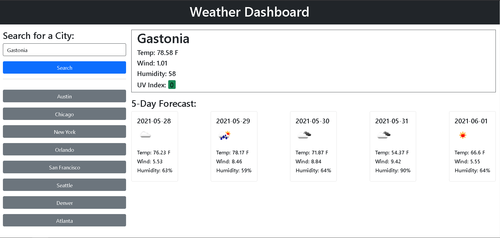

# Weather Dashboard app

## [Link to app](https://b00000001.github.io/weather-dashboard/)

### This app makes use of the openweathermaps API to grab the associated data.

### App Usage

- This app is intended to be a weather dashboard that you can use to track your current weather conditions.
- App has a 5 day foreast section for each city that is selected.
- The current conditions will show in the main 'Jumbotron' like section on the page
- The five day forecast will show under this section in 5 card sections on the page.

- The 5 day forecast UV index is color coded in 3 ways.
- If the index is above 7, the color will be red.
- If the index is above 5, the color is yellow.
- If the index is below 5, the color is green.
