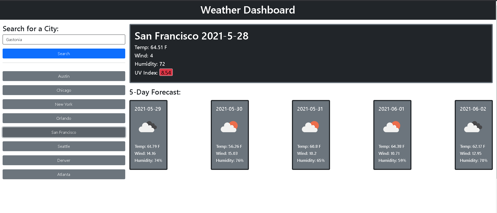

<h1 align='center'>Weather Dashboard</h1>

# Description

A daily weather dashboard that leverages API data to display your local weather in a 5 day format. The weather has icons to display the current or future conditions and also has a color coded UV index.

- This app is intended to be a weather dashboard that you can use to track your current weather conditions.
- App has a 5 day foreast section for each city that is selected.
- The current conditions will show in the main 'Jumbotron' like section on the page
- The five day forecast will show under this section in 5 card sections on the page.

# Table of Contents

1. [Installation](#Installation)
2. [Usage](#Usage)
3. [License](#License)
4. [Contributing](#Contributing)
5. [Collaborators](#Collaborators)
6. [Tests](#Tests)
7. [Questions](#Questions)

# Installation

1. Clone the Repo. (`git clone https://github.com/your_username_/Project-Name.git`
   )
2. Install NPM packages. (`npm install`)

# Usage

- The 5 day forecast UV index is color coded in 3 ways.
- If the index is above 7, the color will be red.
- If the index is above 5, the color is yellow.
- If the index is below 5, the color is green.

# License

# Contributing

Contributions are what make the open source community such an amazing place to be learn, inspire, and create. Any contributions you make are greatly appreciated.

1. Fork the Project
2. Create your Feature Branch (`git checkout -b feature/AmazingFeature`)
3. Commit your Changes (`git commit -m 'Add some AmazingFeature'`)
4. Push to the Branch (`git push origin feature/AmazingFeature`)
5. Open a Pull Request

# Collaborators

1.  b00000001 (http://www.github.com/b00000001)

# Questions

Please visit my github to learn more: <a href='http://github.com/b00000001'>My Github</a>

- If you have any questions for me, please contact me at deas.aaron@gmail.com
